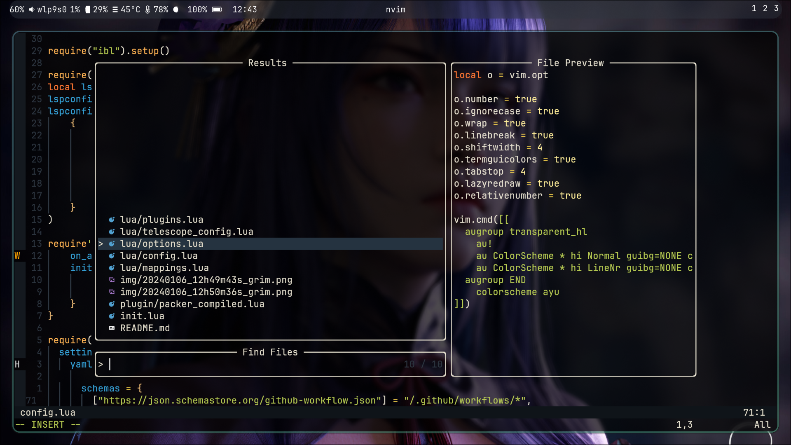

#### My personal nvim configurations



#### Directory Structure
```
├── init.lua
├── lua
│   ├── config.lua
│   ├── mappings.lua
│   ├── options.lua
│   ├── plugins.lua
│   └── telescope_config.lua
├── plugin
│   └── packer_compiled.lua
└── README.md
```
